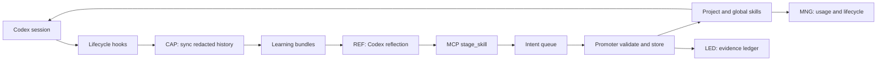

<h1 align="center">Codenomous</h1>

<p align="center">
  
  
  
  
</p>

**Codenomous is a self-learning skill layer for Codex.** It turns real project
sessions into reusable Codex skills, keeps similar lessons consolidated, tracks
which learned skills are actually used, and archives stale self-authored skills
without touching anything you wrote by hand.

It is packaged in the **Codenomous** Codex plugin marketplace: install the marketplace once,
enable **Auto Codex** in the Codex app, trust its hooks, and future Codex
sessions can sync project history, prepare learning bundles, expose MCP tools
for safe skill staging, and apply learned skills when similar work appears.

| | |
|---|---|
| **Learns from real work** | Codex sessions become redacted learning bundles under `.codex/auto-codex/`; no separate data labeling loop is needed. |
| **Consolidates instead of piling up** | The reflector compares against existing project and global skills before proposing a create, patch, update, or archive. |
| **Safe writer boundary** | The model proposes an intent; the deterministic promoter validates and writes. Auto Codex never edits arbitrary skills directly. |
| **Adapts across project types** | Includes adaptive starter skills for crawlers, apps, image work, video work, and general recurring projects. |
| **Evidence stays out of recall** | Reasons and evidence are stored in ledgers and references, keeping `SKILL.md` compact and useful for invocation. |

## Install

Requires `python` on your PATH. Auto Codex uses only the Python standard library.

```bash
codex plugin marketplace add a275374321321/auto-codex-marketplace
```

Then open the Codex app plugin directory, choose the **Codenomous** marketplace,
and install **Auto Codex**.

After installing:

1. Restart Codex so the plugin skills, MCP server, and hooks are loaded.
2. Run `/hooks` and trust the Auto Codex lifecycle hooks.
3. Start a new Codex session in any project. Auto Codex will begin syncing
   learning bundles automatically.

> Some Codex CLI builds expose marketplace management before command-line
> plugin installation. The Codex app plugin directory is currently the most
> portable way to install the plugin after adding the marketplace.

## How It Works

Auto Codex runs beside Codex rather than inside the model's memory. Learned
skills are ordinary Codex skills, so future sessions can invoke them through
Codex's native skill matching.



Diagram source: [`docs/assets/pipeline.mmd`](docs/assets/pipeline.mmd).

| Component | Role |
|---|---|
| **CAP** · capture | Hooks scan recent Codex session history, redact sensitive text, and write learning bundles. |
| **REF** · reflect | Codex reads a bundle and existing skill index, then proposes at most one durable skill intent. |
| **MCP** · stage | `stage_skill` appends an intent to a queue. It does not write live skills. |
| **Promoter** · validate/store | Deterministically validates structure, safety, evidence, ownership, and paths before writing. |
| **MNG** · lifecycle | Tracks usage for self-authored skills and archives low-use mature skills when capacity is exceeded. |
| **LED** · ledger | Stores why a skill was created or changed, plus redacted evidence, outside the main skill body. |

## What Runs Automatically

| Hook | What it does |
|---|---|
| `SessionStart` | Syncs recent Codex history into learning bundles and periodically runs lifecycle pruning. |
| `Stop` | Refreshes bundles every few turns so long-running work is captured. |
| `PreCompact` | Preserves a fuller learning bundle before context compaction. |
| `PreToolUse` | Records usage for self-authored learned skills when a skill-name event is available. |

Hooks create bundles and metadata. They do **not** directly invent or write new
skills. A Codex reflection produces an intent, and the deterministic promoter is
the only writer.

## MCP Tools

Auto Codex exposes a local MCP stdio server:

| Tool | Purpose |
|---|---|
| `stage_skill` | Stage one create/update/patch/delete skill intent into the project queue. |
| `drain_skill_intents` | Promote staged intents through the deterministic validator/writer. |
| `auto_codex_status` | Show roots, inbox status, and the current learned skill index. |

## Example Flow

1. You work on a recurring project, such as an EPC verification crawler, app
   build, media workflow, or image-editing task.
2. Auto Codex hooks sync the session into `.codex/auto-codex/bundles/`.
3. Codex reviews a bundle and decides whether to patch an existing skill or
   create a new project-specific one.
4. Codex calls `stage_skill`; Auto Codex queues the intent.
5. `drain_skill_intents` promotes valid intents into `.codex/skills/` or
   `~/.codex/skills/`.
6. Future similar projects can automatically invoke the learned skill.

## How It Compares

| | Unbounded notes | Manual skills | Auto Codex |
|---|---:|---:|---:|
| Learns from real sessions | No | Only when you remember | Yes |
| Bounds the skill layer | No | Manual cleanup | Yes |
| Touches user-authored skills | N/A | Yes | No |
| Uses native Codex skills | No | Yes | Yes |
| Needs a resident daemon | No | No | No |
| Stores evidence for later review | Usually no | Usually no | Yes |

## Repository Layout

```text
.agents/plugins/marketplace.json     # Codex marketplace catalog
plugins/auto-codex/.codex-plugin/    # Plugin manifest
plugins/auto-codex/hooks/            # Codex lifecycle hooks
plugins/auto-codex/scripts/          # Hook dispatcher and MCP server
plugins/auto-codex/skills/           # Auto Codex and adaptive project skills
docs/assets/pipeline.mmd             # Mermaid pipeline source
```

## Tuning

Environment variables:

- `AUTO_CODEX_SYNC_EVERY_STOPS`: default `3`
- `AUTO_CODEX_SYNC_DAYS`: default `30`
- `AUTO_CODEX_MAX_SESSIONS`: default `12`
- `AUTO_CODEX_MAX_CHARS`: default `16000`
- `AUTO_CODEX_ALL_PROJECTS=1`: scan all recent Codex projects instead of only
  the current working directory
- `AUTO_CODEX_LIFECYCLE_EVERY_HOURS`: default `24`
- `AUTO_CODEX_MATURITY`: default `3`
- `AUTO_CODEX_CAPACITY`: default `50`

## Uninstall

Remove the marketplace from Codex:

```bash
codex plugin marketplace remove codenomous
```

Uninstalling the plugin stops hooks and MCP tooling. Learned skills and Auto
Codex state remain in your project or user skill folders. Remove only
self-authored skills that carry `.auto-codex.json` with `created_by:
auto-codex`.

## Status

Auto Codex is experimental. It is designed for local Codex workflows where the
user controls the workspace and can review hooks, staged intents, and generated
skills.

## License

MIT. See [`LICENSE`](LICENSE).
