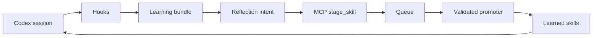

# Codenomous Plugin

Codenomous packages adaptive Codex skills, lifecycle hooks, and an MCP staging
server for self-learning skill maintenance.

Install the **Codenomous** marketplace from the repository root:

```bash
codex plugin marketplace add a275374321321/codenomous
```

Then install **Codenomous** from the Codex app plugin directory and trust its
hooks with `/hooks`.

## Pipeline



## Hooks

- `SessionStart`: sync recent Codex session history and periodically run
  lifecycle pruning.
- `Stop`: refresh learning bundles every few turns.
- `PreCompact`: preserve a fuller bundle before compaction.
- `PreToolUse`: record self-authored learned-skill usage when the hook event
  exposes a skill name.

Hooks create reflection bundles under `.codex/codenomous/`. They do not write
learned skills directly.

## MCP Tools

- `stage_skill`: append one validated learning intent to the project queue.
- `drain_skill_intents`: promote queued intents through the deterministic
  writer.
- `codenomous_status`: show roots, inbox status, and the current learned skill
  index.

## Safety Model

The model proposes JSON intents. `scripts/codenomous.py` is the only writer. It
validates skill names, frontmatter, subfile paths, self-authored sidecars,
redacted evidence, and global-skill portability before writing.

## Tuning

- `CODENOMOUS_SYNC_EVERY_STOPS`: default `3`
- `CODENOMOUS_SYNC_DAYS`: default `30`
- `CODENOMOUS_MAX_SESSIONS`: default `12`
- `CODENOMOUS_MAX_CHARS`: default `16000`
- `CODENOMOUS_ALL_PROJECTS=1`: scan all recent Codex projects
- `CODENOMOUS_LIFECYCLE_EVERY_HOURS`: default `24`
- `CODENOMOUS_MATURITY`: default `3`
- `CODENOMOUS_CAPACITY`: default `50`
